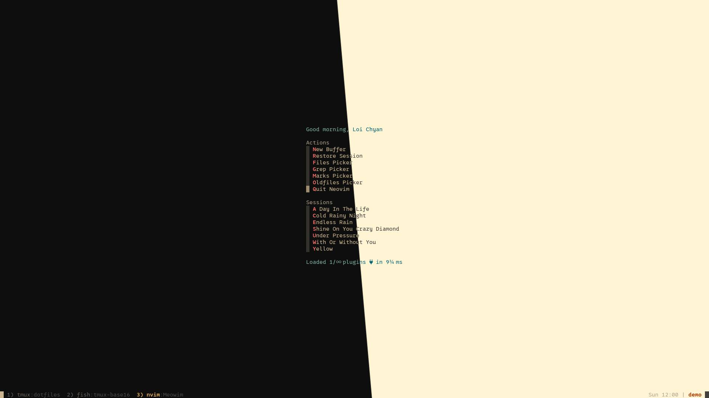

# 🏠 Dotfiles

loichyan's dotfiles.



<details>
<summary id="information">Information</summary>

- font: [0xProto](https://github.com/0xType/0xProto)
- tmux: [tmux-base16](https://github.com/loichyan/tmux-base16)
- Neovim: [Meowim](https://github.com/loichyan/Meowim)

</details>

## ✨ Overview

- Operating system: [Fedora Silverblue](https://silverblue.fedoraproject.org/)
- Dotfile manager: [Chezmoi](https://github.com/twpayne/chezmoi)
- Package manager: [Home Manager](https://github.com/nix-community/home-manager)
- Shell: [Fish](https://fishshell.com/)
- Development environment: [Meowim](https://github.com/loichyan/Meowim)
- Terminal: [Alacritty](https://alacritty.org/) &
  [Termux](https://github.com/termux/termux-app) &
  [tmux](https://github.com/tmux/tmux)

## 🚀 Installation

### Deploy dotfiles

Check out <https://www.chezmoi.io/> for more advanced usage.

```sh
chezmoi apply
```

### Setup Home Manager

Build the first generation of Home Manager (following
[this guide](https://rycee.gitlab.io/home-manager/index.html#ch-nix-flakes)):

```sh
nix run home-manager/master -- switch
# (Optional) Install nixGL to use graphical apps
nix profile install nix-community/nixGL --impure
```

## ⚖️ License

Licensed under either of

- Apache License, Version 2.0 ([LICENSE-APACHE](LICENSE-APACHE) or
  <http://www.apache.org/licenses/LICENSE-2.0>)
- MIT license ([LICENSE-MIT](LICENSE-MIT) or
  <http://opensource.org/licenses/MIT>)

at your option.
