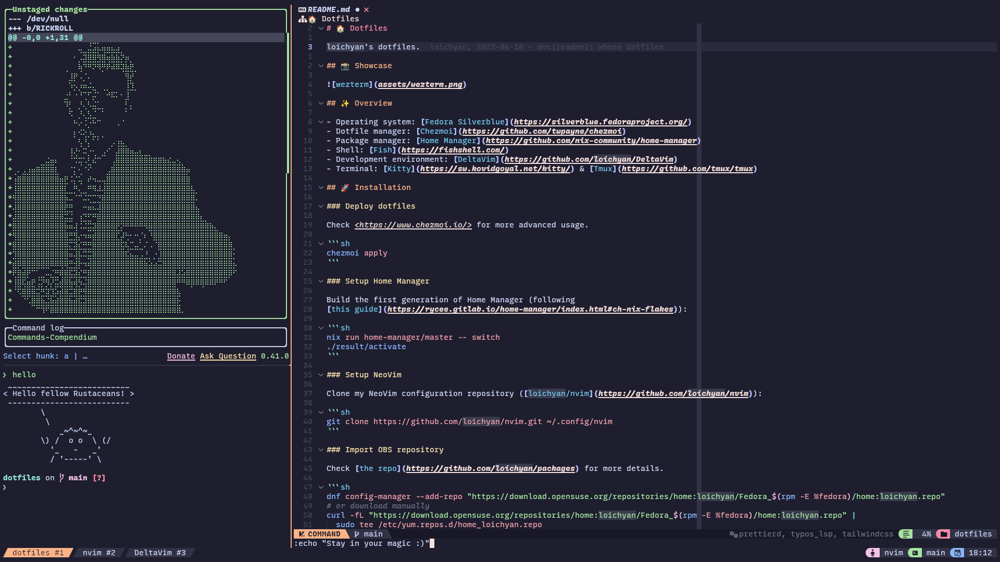

# 🏠 Dotfiles

loichyan's dotfiles.

## 📸 Showcase



## ✨ Overview

- Operating system: [Fedora Silverblue](https://silverblue.fedoraproject.org/)
- Dotfile manager: [Chezmoi](https://github.com/twpayne/chezmoi)
- Package manager: [Home Manager](https://github.com/nix-community/home-manager)
- Shell: [Fish](https://fishshell.com/)
- Development environment: [DeltaVim](https://github.com/loichyan/DeltaVim)
- Terminal: [Kitty](https://sw.kovidgoyal.net/kitty/) & [Tmux](https://github.com/tmux/tmux)

## 🚀 Installation

### Deploy dotfiles

Check <https://www.chezmoi.io/> for more advanced usage.

```sh
chezmoi apply
```

### Setup Home Manager

Build the first generation of Home Manager (following
[this guide](https://rycee.gitlab.io/home-manager/index.html#ch-nix-flakes)):

```sh
nix run home-manager/master -- switch
# (Optional) Install nixGL to use graphical apps
nix profile install nix-community/nixGL --impure
```

### Setup NeoVim

Clone my NeoVim configuration repository ([loichyan/nvim](https://github.com/loichyan/nvim)):

```sh
git clone https://github.com/loichyan/nvim.git ~/.config/nvim
```

### Import OBS repository

Check [the repo](https://github.com/loichyan/packages) for more details.

```sh
dnf config-manager --add-repo "https://download.opensuse.org/repositories/home:loichyan/Fedora_$(rpm -E %fedora)/home:loichyan.repo"
# or download manually
curl -fL "https://download.opensuse.org/repositories/home:loichyan/Fedora_$(rpm -E %fedora)/home:loichyan.repo" | sudo tee /etc/yum.repos.d/home_loichyan.repo
```

## ⚖️ License

Licensed under either of

- Apache License, Version 2.0 ([LICENSE-APACHE](LICENSE-APACHE) or <http://www.apache.org/licenses/LICENSE-2.0>)
- MIT license ([LICENSE-MIT](LICENSE-MIT) or <http://opensource.org/licenses/MIT>)

at your option.
