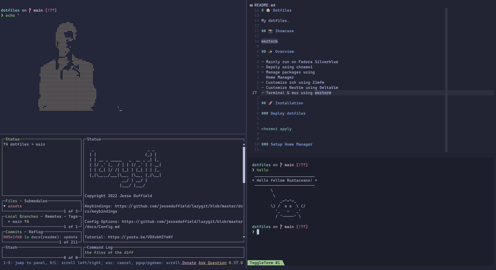

# 🏠 Dotfiles

My dotfiles.

## 📸 Showcase



## ✨ Overview

- Mainly run on [Fedora Silverblue](https://silverblue.fedoraproject.org/)
- Depoly using [chezmoi](https://github.com/twpayne/chezmoi)
- Manage packages using
  [Home Manager](https://github.com/nix-community/home-manager)
- Customize zsh using [Zimfw](https://zimfw.sh/)
- Customize NeoVim using [DeltaVim](https://github.com/loichyan/DeltaVim)
- Terminal & mux using [wezterm](https://wezfurlong.org/wezterm)

## 🚀 Installation

### Deploy dotfiles

Check [the website](https://www.chezmoi.io/) for more advanced usage.

```sh
chezmoi apply
```

### Setup Home Manager

Build the first generation of Home Manager (following
[this guide](https://rycee.gitlab.io/home-manager/index.html#ch-nix-flakes)):

```sh
cd ~/.config/nixpkgs
nix build ".#homeConfigurations.${YOUR_USER}.activationPackage"
./result/activate
```

### Import Copr repository

Check [the repo](https://github.com/loichyan/rpms) for more details.

```sh
sudo dnf copr enable loichyan/packages
# Or download manually
source /etc/os-release &&
  curl "https://copr.fedorainfracloud.org/coprs/loichyan/packages/repo/$ID-$VERSION_ID/dnf.repo" |
  sudo tee /etc/yum.repos.d/_copr:copr.fedorainfracloud.org:loichyan:packages.repo

```

## ⚖️ License

Licensed under either of

- Apache License, Version 2.0 ([LICENSE-APACHE](LICENSE-APACHE) or
  <http://www.apache.org/licenses/LICENSE-2.0>)
- MIT license ([LICENSE-MIT](LICENSE-MIT) or
  <http://opensource.org/licenses/MIT>)

at your option.
